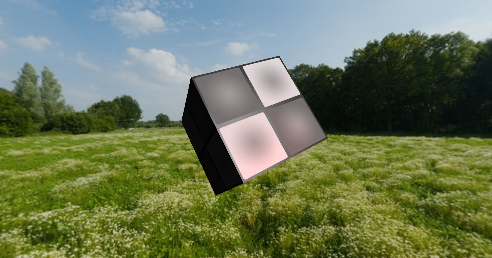

# Flare engine

> [!NOTE]
> Development and updates are on hold for a while

### A toy engine/framework
Inspired on the Urho3D engine and Hazel engine

### [Sandbox sky textyre by AmbientCG](https://ambientcg.com/view?id=DayEnvironmentHDRI112)

- - -

### Features and vendor

- GLTF loader (by cgltf);
- Image loader (by stb);
- Custom Entity Component;
- OpenGL 4.6 core and Vulkan -vulkan not yet implemented- (by Glad 2.0);
- Windowing (by glfw);
- Math (by glm).
- Forward rendering (8 lights + one directional light are suported)
- Physics -not yet implemented (by Box3D)

- - -

### Building from source

> [!CAUTION]
> Never run scripts without researching or reading what they do!

Unix-like systems
``` shell
    # Clone
    git clone --recursive https://github.com/MunFaill/Flare.git

    # Build script
    cd Flare && ./build.sh

    # Execute (From the root folder)
    ./build/Sandbox
```
- - -
### Using Flare in your project

On your CMakeLists.txt, add:

``` CMake
# Your cmake code [...]

add_subdirectory(External/Flare) # The path to Flare folder
add_executable(YourApp main.cpp)
target_link_libraries(YourApp PRIVATE Flare)

# Your cmake code [...]
```

### See [Sandbox](Sandbox) for use examples.
- - -
### Images from Sandbox application:
