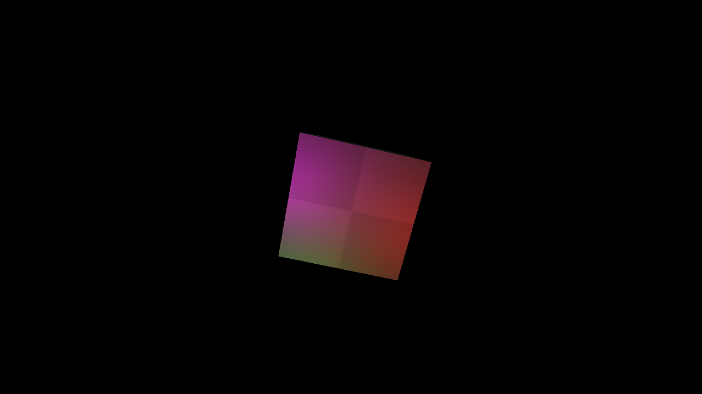
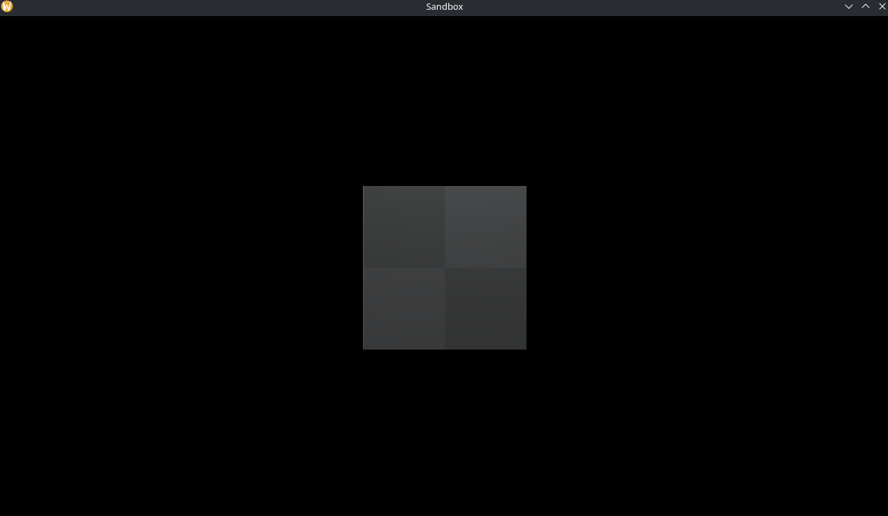

# Flare engine

### A toy engine/framework
Inspired on the Urho3D engine and Hazel engine

[Default texture by Kenney](https://kenney.nl/assets/prototype-textures)

### Features and vendor

- GLTF loader (by cgltf);
- Image loader (by stb);
- Custom Entity Component;
- OpenGL 4.6 core and Vulkan -vulkan not yet implemented- (by Glad 2.0);
- Windowing (by glfw);
- Math (by glm).
- Forward rendering (8 lights + one directional light are suported)

### Building from source

> [!CAUTION]
> Never run scripts without researching or reading what they do!

Unix-like systems
``` shell
    # Clone
    git clone --recursive https://github.com/MunFaill/Flare.git

    # Build script
    cd Flare && ./build.sh

    # Execute (From the root folder)
    ./build/Sandbox
```

See [Sandbox](Sandbox) for use examples.

### Images from Sandbox application:



### What to come:
- [ ] Forward+ rendering
- [x] Better material (With multiple texture chanels for object)
- [ ] Skybox
- [x] Fix camera stretch
- [ ] Basic UI
